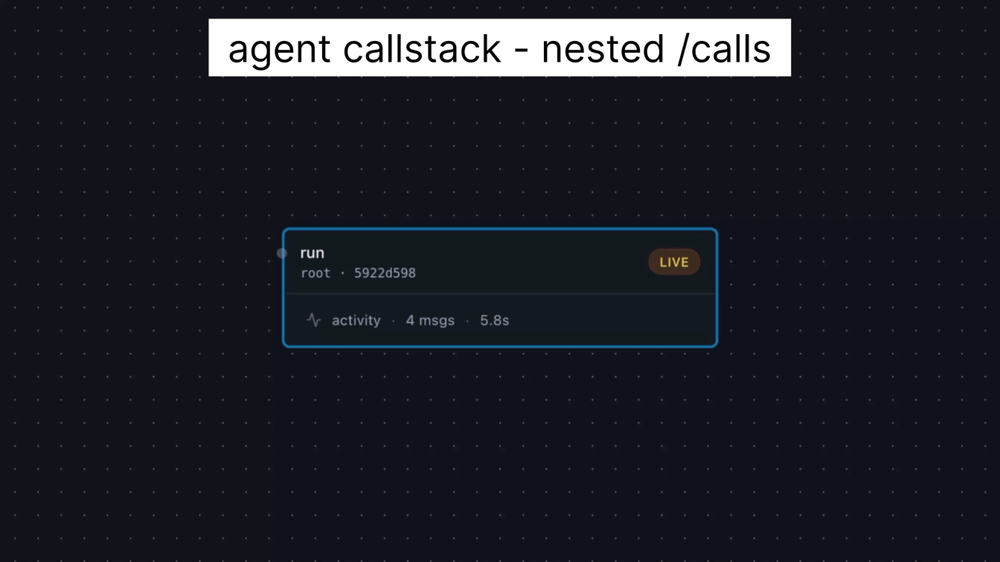

# callstack

Call stacks let humans build complex software by **scoping complexity** and **scoping memory and variables**. No matter how deep execution goes, the code runs with the full context of the program, and the language runtime guarantees the call stack unwinds deterministically as functions return.

No equivalent capability exists for ReAct-loop based agents — and Claude Code is a ReAct-loop based agent harness. These agents accumulate context linearly, and as the conversation grows, important early details get crowded out and the agent loses track. Subagents are available to execute side tasks in a fresh context and return results back, keeping execution detail out of the main context — but a subagent must be sent every piece of context it needs, which wastes token generation. Recently, Claude Code shipped an experimental subagent mode called [`/fork`](https://docs.claude.com/en/docs/claude-code) where forked subagents run in a forked session and inherit the parent's context. But as of today, forked agents cannot themselves fork (no deep call stacks), and no user interaction is allowed inside a forked subagent — both limits constrain real use.

## Why are deep call stacks necessary?

Most real-world workflows are deep. Consider a customer-support refund: the orchestrator authenticates the customer (which itself fans out into identity verification, MFA challenge, MFA validation), looks up the order (lookup → eligibility check → return-window check), and processes the refund (condition assessment → calculation → payment → email). Each step may itself need to delegate further. Flatten the whole thing into one ReAct loop and the agent must hold every intermediate detail in context simultaneously.

LLMs are notoriously poor at maintaining a deep call chain and reliably unwinding as tasks finish. The longer the chain, the more likely the orchestrator forgets the original goal by the time control returns to it.

## What the callstack plugin delivers

- **`/call` simulates a function call.** Fork the parent's session, run the task, return a compact result.
- **Parallel forks.** Run multiple tasks simultaneously with one invocation: `/call do X, do Y, and do Z in parallel`. The user-facing surface stays `/call`; the skill picks single vs parallel internally.
- **Calls return the result and a path to the full session JSON.** If the caller later needs a detail the child didn't include, file access reaches the full transcript without burning more context.
- **Interactivity at any depth.** A `/call` can pause and ask the user from any frame — without paying the cost of bubbling the question through every intermediate node (which would otherwise require, and waste, an LLM turn at each level).
- **Calls run in the parent's full context** — so the invocation is one line, not a hand-rolled context dump.
- **Calls run in the parent's full context** — so the child understands what tasks will follow, and shapes its return payload to include what the caller will need next.

```
Agent "implement app.."
│    context: [S░░░░░░░░░░░░░░░░░░░░░░]   ← system prompt S
│    (does some work)
│    context: [SAAAAAA░░░░░░░░░░░░░░░░]   ← accumulates A activities
│    /call "implement auth module"            ← forked session
│    │    context: [SAAAAAA░░░░░░░░░░░░░░░░]  ← inherits S+A
│    │    (does some work)
│    │    context: [SAAAAAABBBBBBBB░░░░]      ← accumulates B activities
│    │    /call "write JWT middleware"             ← forked session
│    │    │    context: [SAAAAAABBBBBBBB░░░░]      ← inherits S+A+B
│    │    │    (does some work)
│    │    │    context: [SAAAAAABBBBBBBBCCC░]      ← accumulates C activities
│    │    │    return {result c}                   ← return result c
│    │    │                                        ← exit forked session
│    │    context: [SAAAAAABBBBBBBBc░░░░]     ← c added instead of CCC
│    │    (does some work)
│    │    context: [SAAAAAABBBBBBBBcBB░░]     ← accumulates more B activities
│    │    return {result b}
│    │
│    context: [SAAAAAAb░░░░░░░░░░░░░░░░]  ← b added instead of BBBBBBBBcBB
│    (does some work)                     ← continues with clean context
```

Forked sessions share the parent's exact token prefix, so prompt caching (~90% cheaper) applies automatically.

## Install

Two ways, pick one.

**Claude Code marketplace** (recommended):

```
/plugin marketplace add unwind-labs/callstack
/plugin install callstack@unwind-labs
```

**Manual** (clone the repo, drop the plugin into your Claude Code plugins directory):

```bash
git clone https://github.com/unwind-labs/callstack
cp -r callstack/plugins/callstack ~/.claude/plugins/
```

The plugin bundles the `/call` skill at `plugins/callstack/skills/call/SKILL.md`, the MCP server at `plugins/callstack/mcp_server.py`, and a SessionStart hook — all wired up automatically by Claude Code's plugin loader.

## Quick start

Once installed, Claude Code can use `/call` directly.

```
You: "/call Implement the auth module, then /call write tests for it"

Claude: I'll handle this in two calls to keep my context clean.

[call - invoke (MCP): task="Implement JWT auth in src/auth.py"]
→ {"status": "complete", "result": "Created src/auth.py with login/logout/refresh endpoints..."}

[call - invoke (MCP): task="Write tests for src/auth.py"]
→ {"status": "complete", "result": "Created tests/test_auth.py, 12 tests, all passing..."}
```

For independent tasks, ask for parallel execution and the skill fans them out in a single fork:

```
You: "/call profile the API, audit the deps, and benchmark the renderer in parallel"

Claude: Running all three concurrently.

[call - invoke_parallel (MCP): tasks=["Profile the API", "Audit the deps", "Benchmark the renderer"]]
→ [{"status": "complete", "result": "API: p99 184ms, hot path is..."},
   {"status": "complete", "result": "Deps: 3 outdated, 1 CVE in..."},
   {"status": "complete", "result": "Renderer: 47 fps median, dropped frames at..."}]
```

Each forked session sees the full conversation so far (knew what patterns you discussed, what files exist, what your preferences are) but its intermediate work — the 50 tool calls, the failed attempts, the debugging — never enters the parent's context.

This is unlike subagents which do not see the conversation context, so all context has to be hand-rolled and passed in. Subagents are right for genuinely independent tasks; most workflow steps benefit from inherited context.

## Example: customer support refund

The `examples/customer_support/` directory demonstrates a complete workflow — customer authentication with MFA, order lookup, and refund processing — using skills and MCP tools.

```bash
cd examples/customer_support
claude
# Say: "Process a refund"
# Say: cust_7829 ord_91847 sarah.chen@example.com +15550142 did not like product
# Say: 847291
```

### What happens

```
Orchestrator (interactive session with user)
  │
  ├─ /call authenticate-customer           16.6s
  │    ├── verify_customer_identity tool      (inline)
  │    ├── get_customer tool                  (inline)
  │    ├── send_mfa_code tool                 (inline)
  │    └── op: yield   "Enter MFA code"       (ask user)
  │         user: "847291"
  │    └── validate_mfa_code tool             (inline)
  │    └── op: return  "Authenticated, session created"
  │
  ├─ /call lookup-order                     27.0s
  │    └── op: return  "2 items eligible, within return window"
  │
  └─ /call process-refund                    9.2s + 24.6s
       └── op: yield   "Item condition? (unopened/opened/damaged)"
            user: "damaged"
       └── calculate_refund, process_payment, send_email
       └── op: return  "Refund $82.48, txn_ref_88291"
```

## Example: parallel calls with nested forks

The `examples/parallel_calls/` directory demonstrates parallel fan-out with nested parallelism — the orchestrator calls three agents simultaneously, and one of those agents itself forks into two parallel sub-agents.

```bash
cd examples/parallel_calls
claude
# Say: "run"
```

### What happens

```
A (orchestrator)
├── B  (weather report — leaf)               ──┐
├── C  (market brief — fork node)            ──┤ parallel
│   ├── E  (exchange rates — fork node)  ──┐   │
│   │   ├── G  (JPY rate — leaf)  ──┐      │   │
│   │   └── H  (GBP rate — leaf)  ──┘      │ nested parallel inside E
│   └── F  (news headlines — leaf)      ──┘   │ nested parallel inside C
└── D  (stock report — leaf)                 ──┘

A calls {B, C, D} in parallel via --tasks
  B calls get_weather("Tokyo"), get_weather("London"), returns
  C calls {E, F} in parallel via --tasks (nested fork)
    E calls {G, H} in parallel via --tasks (3-level deep nested fork)
      G calls get_exchange_rate("JPY"), returns
      H calls get_exchange_rate("GBP"), returns
    E combines G+H results, returns
    F calls get_news_headline("tech"), get_news_headline("finance"), returns
  C combines E+F results, returns
  D calls get_stock_price("AAPL"), get_stock_price("GOOGL"), returns
A validates all 6 expected values: PASS
```

Each parallel branch independently supports the full `call`/`yield`/`return` protocol — a branch can delegate further, pause for user input, or return, without blocking its siblings.

**This is how you compose a deep call stack out of Claude Code Skills.** Each node in the tree (B, C, D, E, F, G, H) is a Claude Code Skill defined in `examples/parallel_calls/.claude/skills/task-*/SKILL.md`. `/call` invokes them by name, and any Skill is free to itself `/call` other Skills — that's how depth grows. Skills become the "functions" in the call stack: small, named, composable units the orchestrator wires together.

## How it works

Claude Code stores each conversation as a JSONL session file on disk.

### Session fork

When you `/call`, the runtime (the `agent_callstack` package) discovers the parent's session file (via `CLAUDE_SESSION_ID` env var or by finding the most recently modified session JSONL) and spawns a forked child:

```
claude --resume <session-id> --fork-session \
       --output-format stream-json --input-format stream-json \
       --permission-prompt-tool stdio
```

`--fork-session` creates an independent copy of the session — the child wakes up with the parent's full message history plus the new task appended. It doesn't know it's a fork. It just continues the conversation.

### Bidirectional JSON protocol

The parent and child communicate over stdin/stdout using NDJSON (newline-delimited JSON). This enables two critical capabilities:

**Permission control** — When the child requests permission to use a tool (Bash, file writes, etc.), the request arrives as a structured message:

```json
{"type": "control_request", "request_id": "req_...", "request": {"subtype": "can_use_tool", "tool_name": "Bash", "input": {...}}}
```

The runtime intercepts this and responds programmatically — no human in the loop for forked sessions:

```json
{"type": "control_response", "response": {"subtype": "success", "request_id": "req_...", "response": {"behavior": "allow", "updatedInput": {...}}}}
```

**User input (yield)** — When a child needs information only the user can provide (e.g., an MFA code), it emits a `{"op": "yield", "question": "..."}` envelope in a fenced ` ```json ` block as its final output. The runtime serializes the execution tree to a `.call_tree` sidecar file, exits, and returns the question as JSON:

```json
{"status": "yield", "question": "Enter the 6-digit MFA code", "session_id": "abc-123"}
```

The parent asks the user, then calls `invoke_resume(resume_session="abc-123", user_reply="847291")`. The runtime reloads the tree from disk and continues from exactly where it paused.

### Three control operations

The child runs, does its work, and emits exactly one JSON envelope wrapped in a fenced ` ```json ` code block as its final output. The `op` field selects one of three operations:

- `{"op": "return", "result": ..., "summary": ..., "next": ...}` — done. The runtime captures the result, saves a trace to `call_traces/`, and hands the compact result back to the parent as JSON. `summary` and `next` are optional.
- `{"op": "call", "task": "..."}` — the child wants to delegate further. The runtime adds a child node to the execution tree and forks again. Same mechanism, one level deeper (up to depth 5).
- `{"op": "yield", "question": "..."}` — needs user input. The tree is persisted to disk so the session can be resumed later.

### Execution tree

The runtime manages an **execution tree** rather than a linear stack. Each node holds an immutable state value (`Pending`, `AwaitingTurn`, `AwaitingChild`, `AwaitingUser`, `Done`, `Failed`); transitions are computed by a pure `step(state, event) -> (new_state, [effects])` function in `agent_callstack.state`. The driver in `agent_callstack.driver` performs the effects (subprocess turns, child spawns) and feeds the resulting events back. For parallel tasks (`invoke_parallel`), sibling root nodes run concurrently via `ThreadPoolExecutor`. When a node yields, the entire subtree is snapshotted to a `.call_tree` sidecar; resume reloads it and re-enters the loop with `UserReplied`.

### Package layout

```
plugins/callstack/agent_callstack/
  __init__.py    Public API: call, call_many, resume, Caller, Result
  state.py       Pure state machine: discriminated unions + step()
  driver.py      Effect runner: ties channel + state + tree together
  channel.py     Claude CLI subprocess + NDJSON protocol (the only seam)
  protocol.py    SYSTEM_INSTRUCTION + envelope parser
  session.py     SessionLocator: ~/.claude/projects discovery
  trace.py       TraceWriter (JSONL) + TreeStore (sidecar snapshots)
  analysis.py    SessionAnalyzer: post-execution structured inspection
```

## How is `/call` better than `/fork`?

Both `/call` and Anthropic's experimental `/fork` are built on the same underlying CLI primitive — `claude --session-id <uuid> --fork-session`, which copies a named session and resumes the forked copy with the parent's full context. They are sibling runtimes on that primitive, not parent/child. Here is how they compare:

| Capability   | Claude Code `/fork`                                        | callstack `/call`                                                      |
|--------------|------------------------------------------------------------|------------------------------------------------------------------------|
| Fork depth   | Single level — forks cannot fork                           | Arbitrary depth — full recursive call stack                            |
| Interactivity| Background only; result returns as a message               | Interactive at every level; user can drop into any frame               |
| Runtime mode | Interactive sessions only; disabled in non-interactive use | Works headless via `claude -p`                                         |
| Observability| None — fork runs in a side panel                           | [unwind](https://pypi.org/project/unwind-labs/): live web UI of the call tree across all sessions |
| Concurrency  | Implicit                                                   | `CALLSTACK_MAX_CONCURRENT_FORKS` semaphore for wide fan-out            |

**Depth.** `/fork` is one level deep — a fork cannot itself fork. Real workflows nest: "implement app" calls "implement auth module" calls "write JWT middleware". `/call` is recursive (default cap 5 levels), so the whole tree runs as a proper call stack instead of being flattened into the parent.

**Interactivity at every level.** A `/fork` runs in the background and returns a message when done. A `/call` can pause mid-execution with `{"op": "yield", "question": "..."}` and ask the user — at any depth. Auth flows that need an MFA code, refund flows that need a damage assessment, deployments that need a confirmation: the user drops into the exact frame that needs them, then control returns to the stack.

**Headless.** `/fork` is explicitly disabled in non-interactive runs and the Agent SDK. `/call` uses the same `claude --resume … --fork-session` plumbing but drives it over stdin/stdout NDJSON, so it works headless via `claude -p`. Same primitive, no harness gate.

**Observability.** `/fork` runs in a side panel with no external view. unwind-labs ships [unwind](https://pypi.org/project/unwind-labs/), a Python web UI that tails `~/.claude/projects/*.jsonl` and the runtime's `call_traces/` to render a live call tree across all sessions, with each frame's conversation expandable in a side pane.

**Wide fan-out under control.** Each forked `claude` subprocess takes ~0.5–2 GB RSS. A logically wide tree can spawn thousands of pending turns; a module-level semaphore bounded by `CALLSTACK_MAX_CONCURRENT_FORKS` (default 8) keeps physical concurrency under the box's RAM. Excess calls queue instead of OOMing.

`/fork` validated the primitive. `/call` ships the call stack.

## Configuration

### Bounding concurrent `claude` processes

Each forked call spawns a `claude` subprocess (~0.5–2 GB RSS per process). A deep/wide callstack can logically have thousands of pending turns; a module-level semaphore in [plugins/callstack/agent_callstack/channel.py](plugins/callstack/agent_callstack/channel.py) bounds how many run physically at once so the machine doesn't OOM.

Set the cap via the `CALLSTACK_MAX_CONCURRENT_FORKS` environment variable (default `8`):

```bash
# Tight memory (e.g. 16 GB laptop)
export CALLSTACK_MAX_CONCURRENT_FORKS=4

# Larger machine (e.g. 64+ GB)
export CALLSTACK_MAX_CONCURRENT_FORKS=24
```

Rule of thumb: keep `N × 2 GB` comfortably below total RAM. Excess logical calls queue on the semaphore instead of spawning, so correctness is unaffected — only wall-clock latency.

## Credits

Concept and implementation by [Amol Kelkar](https://github.com/amolk). The core idea — function-call semantics for LLM agent orchestration (full context inheritance, compact return) — was first designed and implemented in [Playbooks AI](https://runplaybooks.ai) (2023–2026). The `callstack` plugin generalizes it to any agent harness, starting with Claude Code.
